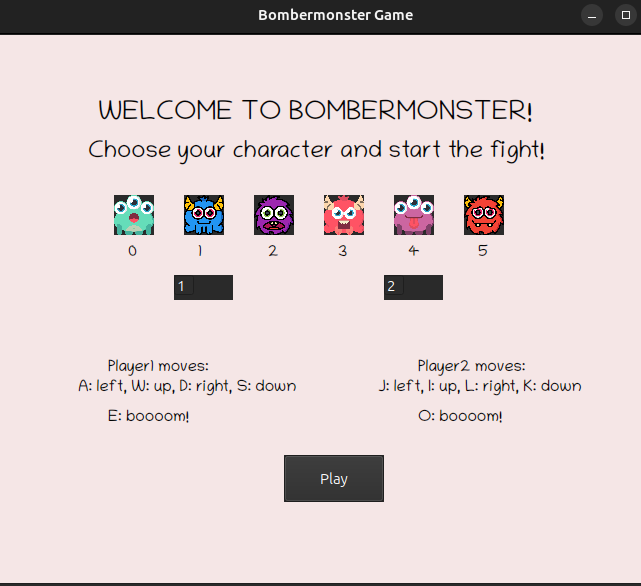
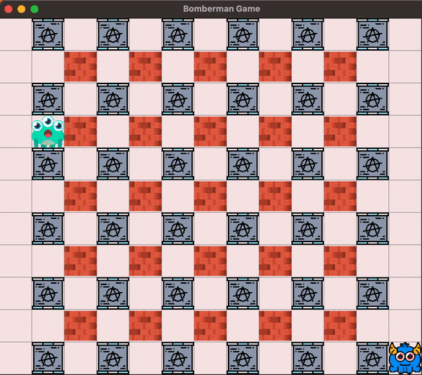

# 💣 Bomberman 
This repository contains own, simple implementation of the "Bomberman" game. The project was carried out as part of the "Introduction to Programming in C++" course at AGH UST in 2023. It is the first project with the use of the QT framework.

# 🛠 Technologies used:
<ul>
  <li> QT6 (Cute6) framework </li>
  <li> Cmake </li>
  <li> C++ </li>
</ul>

# 🎮 Game Demo:

When the game begins, players are presented with a character selection screen and a field to enter icons IDs. Simple instructions for gameplay are also provided. At the bottom, there's a button that, when pressed, starts the game.

 

In the game, one player controls their character's movements using the W A S D keys and strategically lays down bombs by pressing the E key. The second player, on the other hand, navigates their character using the I J K L keys and strategically places a bomb using the O key. The outcome of the game is determined by the player who meets their demise first, which occurs when they find themselves in close proximity to an exploding bomb.

# 👩🏼‍💻 Authors: 
<ul>
   <li> <a href ="https://github.com/irosikoni"> Izabella Rosikoń</a></li>
   <li> <a href ="https://github.com/YoC00lig"> Joanna Kulig</a></li>
 </ul>
